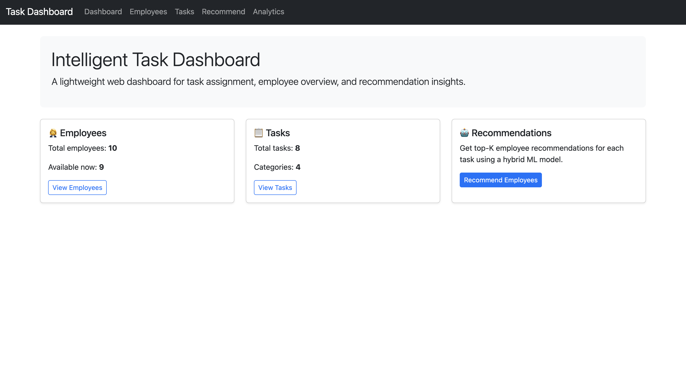
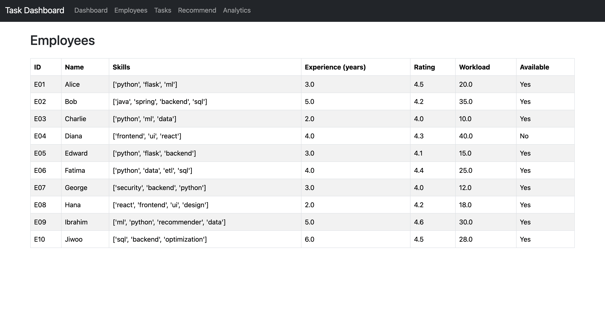
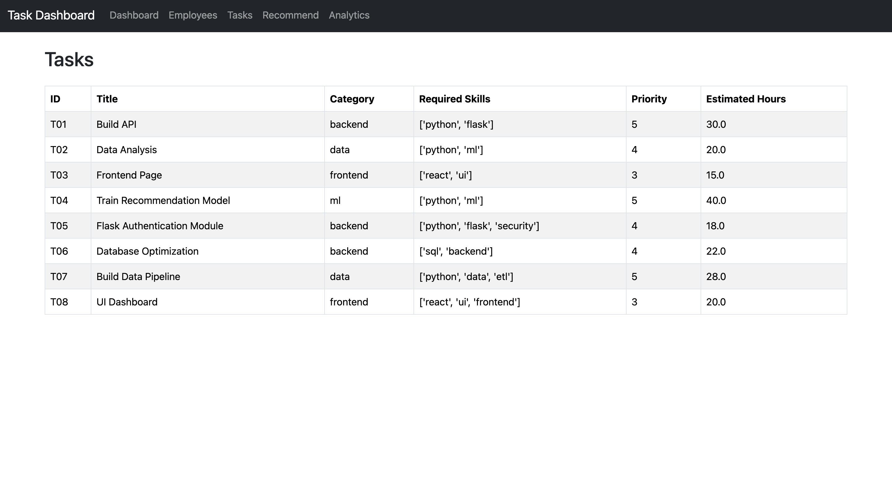
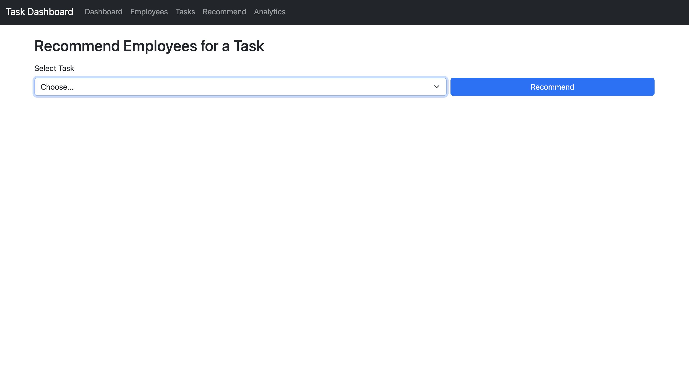
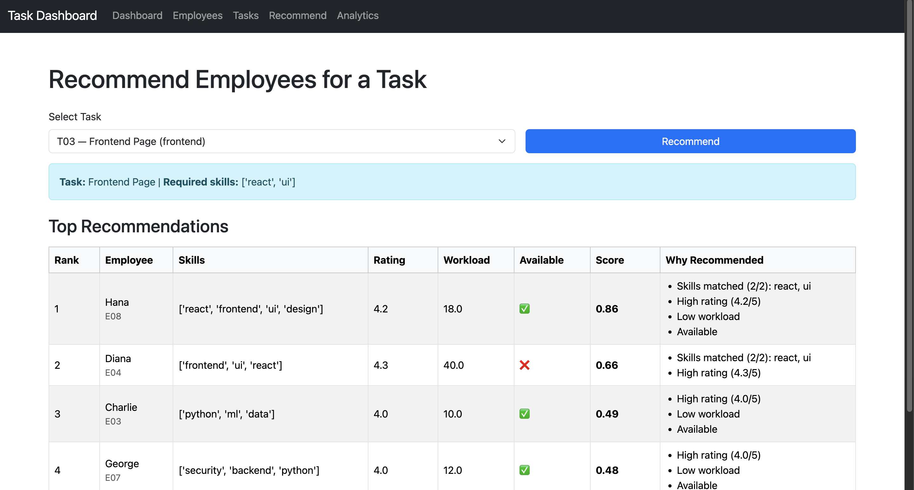

# Intelligent Task Dashboard (Flask + ML)

A Flask-based intelligent task management dashboard with ML-powered task-to-employee recommendations and analytics visualizations.

## Features
- Web dashboard UI (Bootstrap)
- Task-to-employee recommendation page (Top-K recommendations)
- Analytics dashboard with charts (Chart.js)
  - Model metrics comparison (Accuracy, F1-score)
  - Tasks by category
  - Employee workload distribution

## Problem Statement
In real organizations, assigning tasks manually can be subjective and inefficient. This project explores a practical decision-support dashboard that recommends suitable employees for tasks by combining skill matching, performance signals, and workload/availability constraints.

## Recommendation Approach (Hybrid Scoring)
For each task, the system ranks employees using:
- **Skill match ratio** (required skills vs employee skills)
- **Performance signals** (ratings / success patterns)
- **Workload and availability constraints**

The output is a **Top-K ranked list** that is easy to interpret and apply.

## Analytics & Results
The analytics module visualizes:
- **Model comparison** (Accuracy / F1-score)
- **Task distribution** by category
- **Employee workload** distribution

These insights help evaluate system behavior and support better task allocation decisions.

## Screenshots

### Dashboard


### Employees


### Tasks


### Recommendation


### Analytics


## 🔍 Intelligent Employee Recommendations

The system recommends the best employees for a selected task using a
**hybrid, explainable scoring model** based on:

- Skill matching with task requirements
- Employee performance rating
- Current workload
- Availability status

Each recommendation includes a **normalized score (0–1)** and a
clear explanation of *why* the employee was selected.

### Example — Recommendation Results (Explainable)



## Tech Stack
- Python, Flask
- scikit-learn (for ML pipeline results)
- Bootstrap 5 (UI)
- Chart.js (visualization)

## Project Structure
- `app.py` Flask application
- `ml/` ML modules (recommender + CSV loader)
- `data/` synthetic enterprise datasets
- `templates/` HTML templates

## How to Run (macOS)
```bash
cd intelligent-task-dashboard
python3 -m venv .venv
source .venv/bin/activate
pip install -r requirements.txt
python3 app.py

